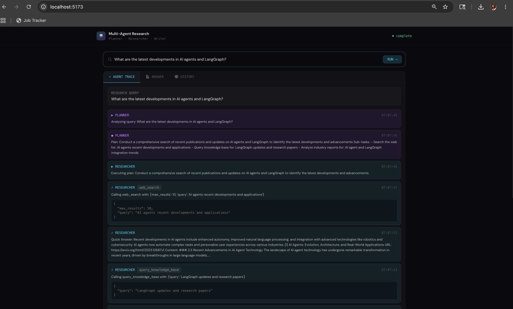
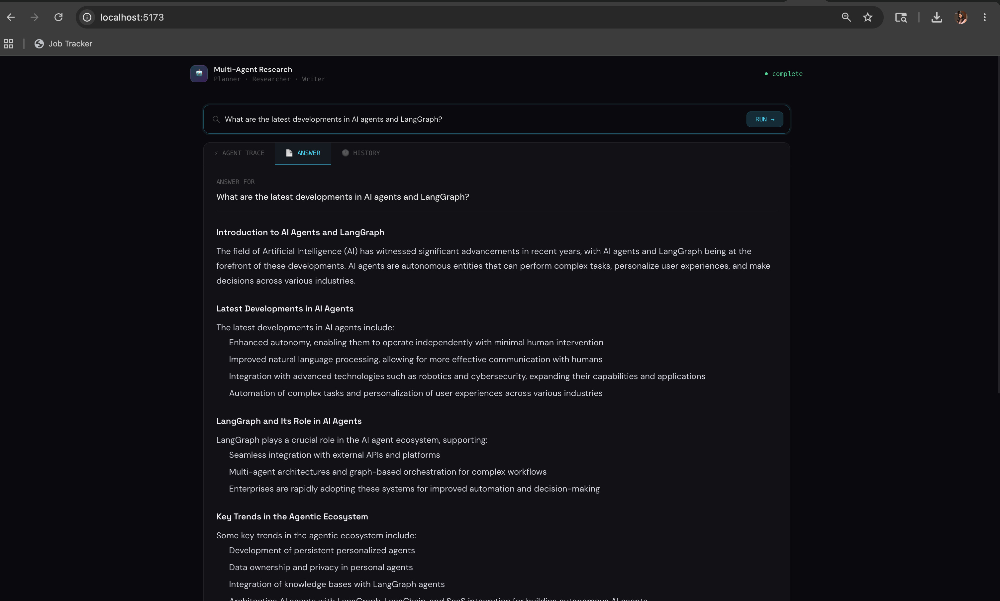

# 🤖 Multi-Agent Research System


## Demo

### Agent Trace — Live tool calling view


### Final Answer — Synthesized markdown response


A production-grade multi-agent AI application featuring tool calling, real-time streaming, and a modern React dashboard.

## Architecture

    User (React UI)
         ↕ WebSocket
    FastAPI Backend
         ↕
    LangGraph Orchestrator
         ├── Planner Agent    — breaks query into sub-tasks
         ├── Researcher Agent — web search, PDF reader, SQL query
         └── Writer Agent     — synthesizes final answer
         ↕
    SQLite + ChromaDB

## Tech Stack

| Layer         | Technology                             |
|---------------|----------------------------------------|
| Orchestration | LangGraph                              |
| LLM           | Groq (llama-3.3-70b-versatile)         |
| Tools         | Tavily (search), PyMuPDF (PDF), SQLite |
| Backend       | FastAPI + WebSockets                   |
| Frontend      | React + TailwindCSS + Zustand          |
| Deploy        | Docker + GitHub Actions                |

## Project Structure

```
multi-agent-research/
├── backend/
│   ├── agents/
│   │   ├── state.py          - Shared LangGraph state
│   │   ├── planner.py        - Planner agent
│   │   ├── researcher.py     - Researcher agent with tool calling
│   │   ├── writer.py         - Writer agent
│   │   └── pipeline.py       - LangGraph graph wiring
│   ├── tools/
│   │   ├── web_search.py     - Tavily web search tool
│   │   ├── pdf_reader.py     - PyMuPDF PDF reader tool
│   │   └── sql_query.py      - SQLite knowledge base tool
│   ├── api/
│   │   ├── main.py           - FastAPI app entry point
│   │   ├── routes.py         - REST endpoints
│   │   └── websocket.py      - WebSocket streaming endpoint
│   ├── core/
│   │   ├── config.py         - Pydantic settings
│   │   └── logging.py        - Logging setup
│   ├── db/
│   │   └── database.py       - SQLAlchemy async models
│   ├── tests/
│   │   └── test_agents.py    - 13 unit tests
│   ├── requirements.txt
│   ├── Dockerfile
│   └── .env.example
├── frontend/
│   ├── src/
│   │   ├── components/
│   │   │   ├── SearchBar.jsx
│   │   │   ├── TracePanel.jsx
│   │   │   ├── AgentEventCard.jsx
│   │   │   ├── AnswerPanel.jsx
│   │   │   └── HistoryPanel.jsx
│   │   ├── hooks/
│   │   │   └── useResearchWebSocket.js
│   │   ├── store/
│   │   │   └── researchStore.js
│   │   ├── App.jsx
│   │   ├── main.jsx
│   │   └── index.css
│   ├── Dockerfile
│   ├── nginx.conf
│   ├── package.json
│   └── vite.config.js
├── .github/
│   └── workflows/
│       └── ci-cd.yml
├── docker-compose.yml
└── README.md
```

## Current Status

- [x] Day 1 — Project scaffold + FastAPI + Database
- [x] Day 2 — Tools (web search, PDF, SQL) + LangGraph Agents
- [x] Day 3 — WebSocket real-time streaming
- [x] Day 4 — React frontend with live agent trace UI
- [x] Day 5 — Docker + GitHub Actions CI/CD
- [x] Day 6 — Unit tests (13 passing)
- [x] Day 7 — Production config + polish

## Quick Start

### Prerequisites
- Python 3.11+
- Node.js 20+
- Groq API key (free at console.groq.com)
- Tavily API key (free at app.tavily.com)

### Backend Setup

    cd backend
    cp .env.example .env
    python3.11 -m venv venv
    source venv/bin/activate
    pip install -r requirements.txt
    uvicorn api.main:app --reload

### Frontend Setup

    cd frontend
    npm install
    npm run dev

### Docker

    docker-compose up --build

## Environment Variables

    GROQ_API_KEY=gsk-...
    TAVILY_API_KEY=tvly-...
    DATABASE_URL=sqlite+aiosqlite:///./research.db
    CHROMA_PERSIST_DIR=./chroma_db
    ENVIRONMENT=development
    LOG_LEVEL=INFO
    CORS_ORIGINS=["http://localhost:5173","http://localhost:3000"]
    GROQ_MODEL=llama-3.3-70b-versatile

## How It Works

1. User submits a query via the React UI
2. WebSocket connection opens between frontend and FastAPI
3. Planner Agent analyzes the query and creates a research plan with 2-4 sub-tasks
4. Researcher Agent executes each sub-task using tools
   - web_search           : searches the web via Tavily API
   - read_pdf             : extracts text from PDF files or URLs
   - query_knowledge_base : queries internal SQLite database
5. Writer Agent synthesizes all findings into a structured markdown answer
6. Each agent event streams live to the React frontend via WebSocket
7. Session is persisted to SQLite for history

## Running Tests

    cd backend
    source venv/bin/activate
    python -m pytest tests/ -v
    # Expected: 13 passed

## CI/CD

On every push to main, GitHub Actions will:
1. Run 13 backend unit tests
2. Build and verify React frontend
3. Build Docker images for backend and frontend


### Required GitHub Secrets

| Secret         | Description           |
|----------------|-----------------------|
| GROQ_API_KEY   | Groq API key          |
| TAVILY_API_KEY | Tavily search API key |

